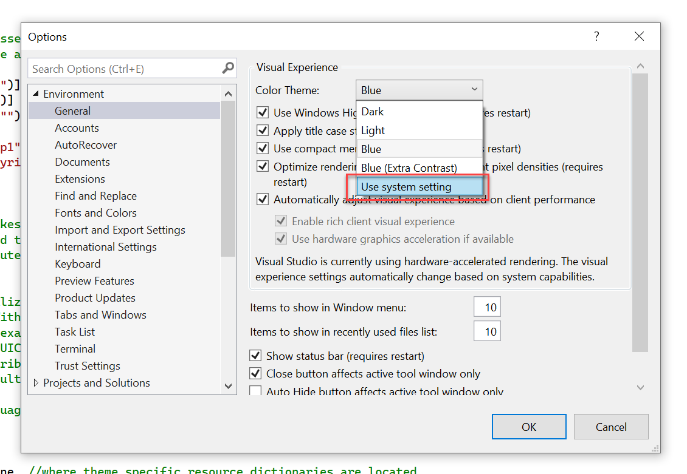

## Features

Automatically change your Visual Studio theme when switching Windows 10 light/dark theme.

Before using, please go to "Tools" → "Options" → "Auto Theme Switcher for Win10" and configure the extension.

## Requirements

• Windows 10 14393 or above

• Visual Studio 2017, 2019 or 2022 (Tested on Community edition)

## ⚠️ About Visual Studio 2022

Visual Studio 2022 now has a built-in "use system theme" option.

But the default Visual Studio light theme for Windows light theme is "Blue", not "Light", and you can't change it.

## Release Notes

### Version 1.0

- Add ARM64 support for Visual Studio 2022

### Version 0.8

- Add support for Visual Studio 2022

## Acknowledgements

Inspired by: https://marketplace.visualstudio.com/items?itemName=danielgjackson.auto-dark-mode-windows

Uses code from: https://marketplace.visualstudio.com/items?itemName=frankschierle.ThemeSwitcher

Extension icon: https://www.flaticon.com/free-icon/sun_740879

&nbsp;

&nbsp;

## 特性

当切换 Windows 10 亮/暗主题时，自动切换 Visual Studio 主题以匹配系统主题。

在使用之前，请前往“工具”→“选项”→“自动匹配Win10亮暗主题”，配置此扩展。

## 要求

• Windows 10 14393 或更高版本

• Visual Studio 2017, 2019 或 2022（在社区版上测试通过）

## ⚠️ 关于 Visual Studio 2022

Visual Studio 2022 现在有了一个内置的 "使用系统主题" 选项。

但是 Windows 亮色主题默认对应的 Visual Studio 亮色主题是 "Blue"，不是 "Light"，并且你不能更改它。

## 发布日志

### 版本 1.0

- 为 Visual Studio 2022 添加 ARM64 支持

### 版本 0.8

- 添加 Visual Studio 2022 支持

## 致谢

灵感：https://marketplace.visualstudio.com/items?itemName=danielgjackson.auto-dark-mode-windows

使用代码：https://marketplace.visualstudio.com/items?itemName=frankschierle.ThemeSwitcher

扩展图标：https://www.flaticon.com/free-icon/sun_740879